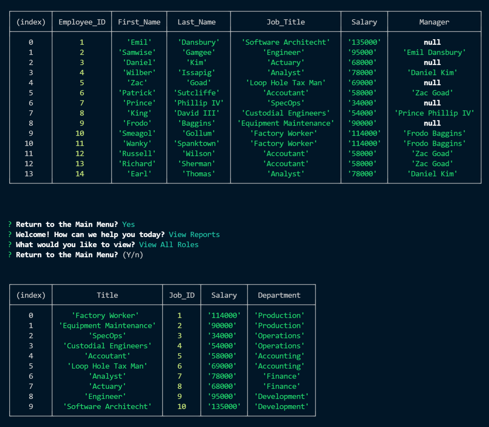

# Employee Tracker
[](https://opensource.org/licenses/MIT)

## Description

This is a node application to track employees, their roles, and the departments for a company.

[Click here for the video walk through.](https://drive.google.com/file/d/1h65iN84JwDtSvUpqZ1b64j6y8_oliDVT/view?usp=sharing)


[](https://drive.google.com/file/d/1h65iN84JwDtSvUpqZ1b64j6y8_oliDVT/view?usp=sharing)

  ## Table Of Contents

* [Installation](#!installation)

* [Usage](#usage)

* [License](#license)

* [Contributing](#contributing)

* [Tests](#tests)

* [Questions](#questions)

================================================

## Installation

To install the necessary dependencies, please run the following command:

```
npm i
```

================================================

## Usage

Please fill out the example .env file included in the repo to run your code locally.

================================================

## License

This project is licensed under the MIT license.

================================================

## Contributing

Nothing

================================================

## Tests

To test if the dependencies are all installed, please run the following command:

```
npm test
```

================================================

## Questions

If you have any questions please reach out to me [HERE](mailto:joshwatkinssfs@gmail.com). You can find more of my work at [MY GITHUB](https://www.github.com/joshuakwatkins/).


